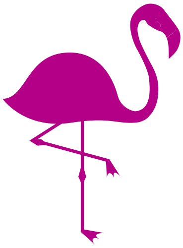
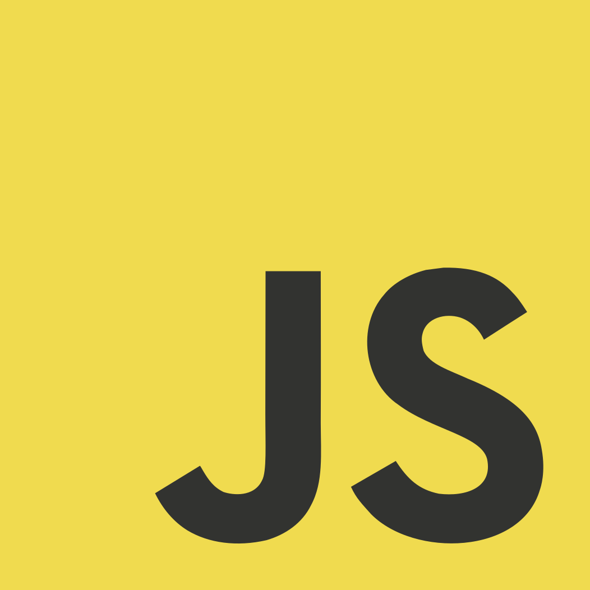
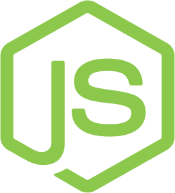
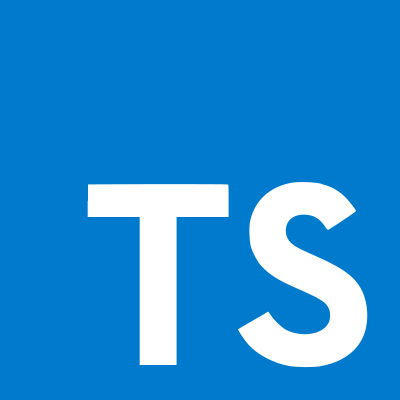

Hey there, reader! 👋

### My name is

# Tomas Arcostanzo

## 📚 About me

I'm a web design from Argentina. I'm currently studying in the second year of the career of computer at the University of Rio Cuarto.  
I'm also studying Next.js. I love writing it code, and I'm a fan of the React.js and Astro, and very fan of the flamingos 🦩.

## 📫 How to reach me

-   [Twitter](https://twitter.com/Tomychi1)
-   [Instagram](https://www.instagram.com/tomas.arcostanzo/)
-   [LinkedIn](https://www.linkedin.com/in/tom%C3%A1s-arcostanzo-4a1b50162/)
-   [My website](https://tomychi.github.io/tomas-arcostanzo/) you can see my portfolio. 👀

## 📚 About current project

I'm currently working on a project called [Gusto](https://www.instagram.com/ganasdegusto/?hl=es) that is a startup of a hamburger restaurant. I'm working with a team of 2 people, and we're using Node.js, React.js, and Firebase.

## 📜 For more information

Check out my [my website](https://tomychi.github.io/tomas-arcostanzo/) to get to know more about me., and my social media accounts.

## 💻 Technologies

## ✨ Thanks for reading

Thanks for reading my profile, and I hope you like my projects. 😊
