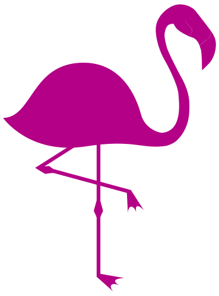

Hey there, reader!

<!-- insertar el logo de public/assets  -->

My name is Tomas Arcostanzo, and I'm a web design from Argentina. I'm currently studying in the second year of the career of computer at the University of Rio Cuarto. I'm also studying Next.js. I love writing it code, and I'm a fan of the React.js and Astro.

I'm currently working on a project called [Gusto](https://www.instagram.com/ganasdegusto/?hl=es) that is a startup of a hamburger restaurant. I'm working with a team of 2 people, and we're using Node.js, React.js, and Firebase.

Check out my [my website](https://tomychi.github.io/my-first-portfolio/) to get to know more about me., and my social media accounts.

## My tech stack

-   HTML
-   CSS
-   JavaScript
-   React.js
-   Node.js
-   Firebase
-   PostgreSQL
-   MongoDB
